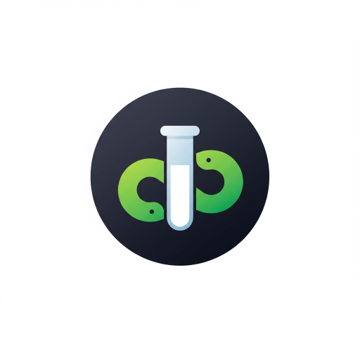

<p align="center">

</p>

# Anvil Testing
Designed as a dependency app to allow for automated testing within anvil.
I've tried to stay consistent with pytest where possible to keep things feeling familiar.  


```
================= Anvil Testing ==================
============ 3TfWQR5BRWY97VVA:master =============
Found 13 tests

  Pass: customer_service/test_config::test_event
> Fail: customer_service/test_config::test_stripe_customers_table - 
	Table: stripe_customers
	 - column 'last_update' must be of type 'string' not 'number'
	 - column 'next_update' not found
  Pass: customer_service/test_config::test_stripe_events_table
  Pass: customer_service/test_event_handler::TestUpdate::test_backwards_update
  Pass: customer_service/test_event_handler::TestUpdate::test_forward_update
  Pass: customer_service/test_event_handler::TestUpdate::test_missing_key_in_update
  Pass: customer_service/test_event_handler::TestUpdate::test_missing_row_data
  Pass: customer_service/test_event_handler::TestUpdateMissing::test_missing
  Pass: customer_service/test_event_handler::TestUpdateMissing::test_overlap
  Pass: customer_service/test_event_handler::TestUpdateMissing::test_unknown
  Pass: customer_service/test_util::test_decode_reference_id
  Pass: customer_service/test_util::test_encode_and_get_row
  Pass: customer_service/test_util::test_encode_row_id

12/13 passed
1 failed tests
====================== FAIL ======================
```

## Testing as a dependency
Include this app as a dependency in your app.
Create a server module or package where your tests will reside.  Note the structure of this app for an example.
For this app I've included tests in the `_test` package to try and keep the imported namespace of this app to a minimum.  This is not required and your test parent directory can by named anything.

## Test Naming
Functions should have the prefix `test_`
Classes should have the prefix `Test`
Class methods should have the prefix `test_`
functions, classes and methods without the prefix are ignored by test collection.

```python
def test_positive():
    result = module_a.calculate()
    assert result > 0, f"Should always be positive {result}"

# this is not seen as a test.
def setup():
    return "something important"

class DummyTable:
    def __init__(self, data):
        self.data

    def get(self, key):
        return data.get(key, None)

    def test_result(self):
        # not seen as part of test pacakge since
        # class name does not start with `Test`
        (do something related to the table)

class TestSuite:
    def test_a(self):
        self.setup()
        assert self.table.get('a') is None

    def test_b(self):
        assert False, 'Test not implemented'

    def setup(self):
        # this is not run as a test.
        self.table = DummyTable({})
```

## Tests
Tests are run using assert statements.  anvil_testing automatically captures these raised assertions and their message to display test failures.

```python
assert True, "this does absolutely nothing."
assert False, "this is raised as a test failure."

assert minimize() < 1, "minimize didn't find a result less than 1"

# assertion messages can be provided as a list, that will be parsed nicely for you.
bunch_of_errors = ['error 1', 'error 2']
assert not bunch_of_errors, bunch_of_errors
```

### Running tests
With the test written, you just need to import your test package and `anvil_testing` and run your tests.

#### console
The tests can be run from the server REPL console.  The downside here is the console needs to be refreshed after changes are made.  
You will get a __click to reload__ message as changes are made.  Putting the three lines into a single block allows for a simple up arrow and enter to run the tests.  Here we are just ignoring the return value since it will print it for us.
This will commonly look like this:

```python
from . import tests
import anvil_testing
_ = anvil_testing.auto.run(tests)
```
#### webpage
You can create a simple endpoint or route which runs the tests.  Capture the return from the test and place it into the body of a `HttpResponse` and you get a simple text test report page that can be refreshed anytime you want to run the tests.  If you clone or use this as a dependency, you will need to publish a debug environment for the following code to work.

This assumes you have a structure like:
```
server_code
  testing/
    test
    tests/
      test_module_1
      test_module_2
      ...

```

Note: `anvil_testing` has a modified version of this webpage creation below.
You can run the tests on this dependency here: [Test anvil_testing](https://ccw3sylsaqhlcf2a.anvil.app/WP2Y7J7IVWI6XXCQKUZS2OXO/test)

#### test.py
```python
from anvil import app

"""
Create a test webpage on the debug environment.
Open the server console to see the app specific web address.
"""
if 'debug' in app.environment.tags and app.id in anvil.server.get_app_origin():
    import anvil.server
    test_endpoint = '/test'
    print('Tests can be run here:')
    print(f"{anvil.server.get_app_origin('debug')}{test_endpoint}")
    
    @anvil.server.route(test_endpoint)
    def run() -> anvil.server.HttpResponse:
        from . import tests
        import anvil_testing
        results = anvil_testing.auto.run(tests, quiet=False)
        return anvil.server.HttpResponse(body=results)
```
This is just to give you some ideas if you have something more specific that you need.
For most cases, using the helper function shown next is much easier.

## Helpers
### Create Test Webpage
The `helpers.create_test_webpage()` method will automatically create a route on your published debug environment URL.

```python
from anvil_testing import helpers
from . import tests

helpers.create_test_webpage(tests, '/test', 'CCW3SYLSAQHLCF2A', 'Display Name')
```

* `tests`: The test directory to search for your tests
* `/test`: The route where you can find your test page
* `APP_ID`: This is the id of your app that can be found in general settings.  This keeps us from trying to make multiple webpages when testing is included in dependencies.
* `Display Name`: This is just text that will be displayed at the top of the test page to help when you have multiple test pages open.

To easily find the test URL you can just open the server console which, on startup, will display:
```python-repl
Tests can be run here:
https://ccw3sylsaqhlcf2a.anvil.app/WP2Y7J7IVWI6XXCQKUZS2OXO/test
```
You can also add `?quiet=true` to the URL to only display the failing tests.  By default all results are displayed.
[https://ccw3sylsaqhlcf2a.anvil.app/WP2Y7J7IVWI6XXCQKUZS2OXO/test](https://ccw3sylsaqhlcf2a.anvil.app/WP2Y7J7IVWI6XXCQKUZS2OXO/test)
[https://ccw3sylsaqhlcf2a.anvil.app/WP2Y7J7IVWI6XXCQKUZS2OXO/test?quiet=true](https://ccw3sylsaqhlcf2a.anvil.app/WP2Y7J7IVWI6XXCQKUZS2OXO/test?quiet=true)


### Table Validation
My thought with the table check is that you could write a dependency app which requires tables then run the tests on the imported dependency to verify you have tables setup correctly in the parent app.

```python-repl
>>> import anvil_testing
>>> import my_dependency
>>> anvil_testing.auto.run(my_dependency.tests.tables) # the path to your table tests.

> Fail: tables::test_my_table - 
	Table: my_table
	 - column 'last_update' must be of type 'string' not 'number'
	 - column 'next_update' not found
```

### Temporary Table Row
You can create temporary rows for usage in testing.  The test row is created using a `with` block.  After the block is exited the row is automatically deleted from the table.
```python
with helpers.temp_row(app_tables.my_table, id='test') as row:
    assert my_func(row) == 42, "The answer is 42"

# Row is automatically removed after leaving the block
```

### Temporary Table Writes
If your tests require additional flexibility, you can enter a temporary write mode that will discard all writes to 
the table after exiting the block.  This is much more flexible than `temp_row` and multiple rows can be added without
nesting `with` blocks.
```python
with helpers.temp_writes():
    new_row = app_tables.my_table.add_row(id='test')
    row = app_tables.my_table.get(id='abc')
    row['info'] = 'new info'

row = app_tables.my_table.get(id='abc')
print(row['info']) -> "previous info"
new_row.get_id() -> raises RowDeleted error.
```

### Raises
It can be helpful to check that your code raised a specific exception when the test runs.  This is done in the same manner as pytest.

Example of `temp_row` and `raises`:

```python 
def test_temp_row():
    with helpers.temp_row(app_tables.my_table, id='TESTING') as row:
        row['api_version'] = '9'
        assert row['id'] == 'TESTING'
        assert row['api_version'] == '9'
    
    # The temp row that we created has been deleted
    with helpers.raises(tables.RowDeleted):
        row.get_id()   
```

## Testing this app
You can run the integrated tests of this app from the server REPL console by running the following

```python-repl
>>> from . import _tests
>>> from . import auto
>>> _ = auto.run(_tests, quiet=True)

===== Automatic test page for anvil_testing ======
============ CCW3SYLSAQHLCF2A:master =============
Collected 25 tests


25/25 passed
0 failed tests
====================== PASS ======================
```

The automatic testing webpage is also available:
[https://ccw3sylsaqhlcf2a.anvil.app/WP2Y7J7IVWI6XXCQKUZS2OXO/test](https://ccw3sylsaqhlcf2a.anvil.app/WP2Y7J7IVWI6XXCQKUZS2OXO/test)